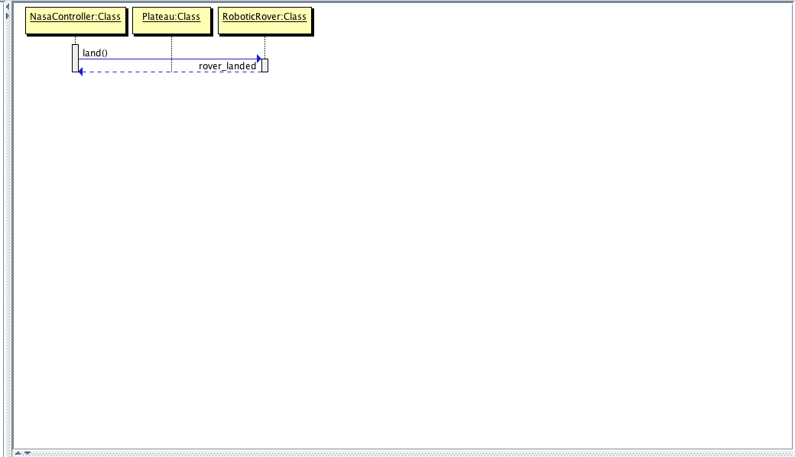
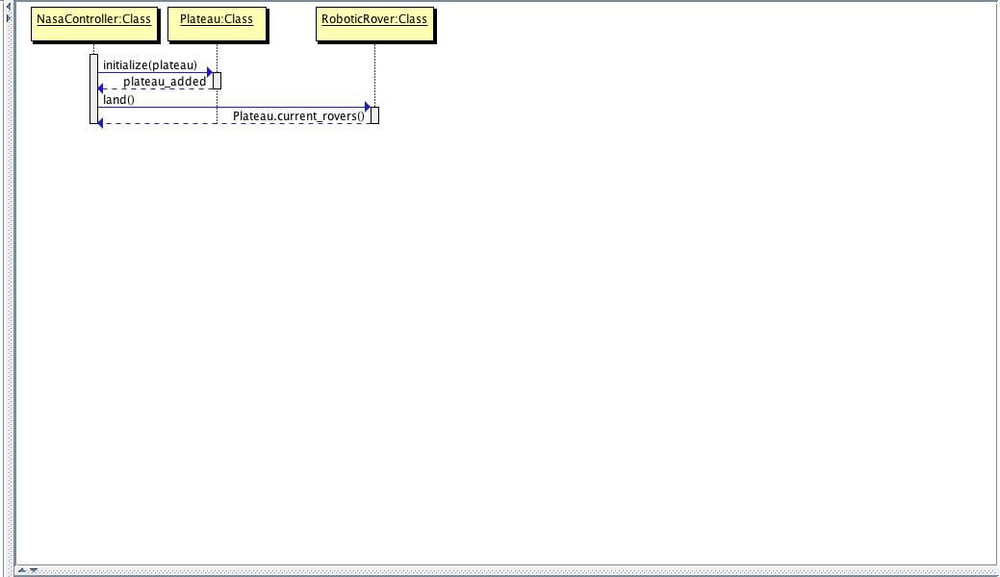
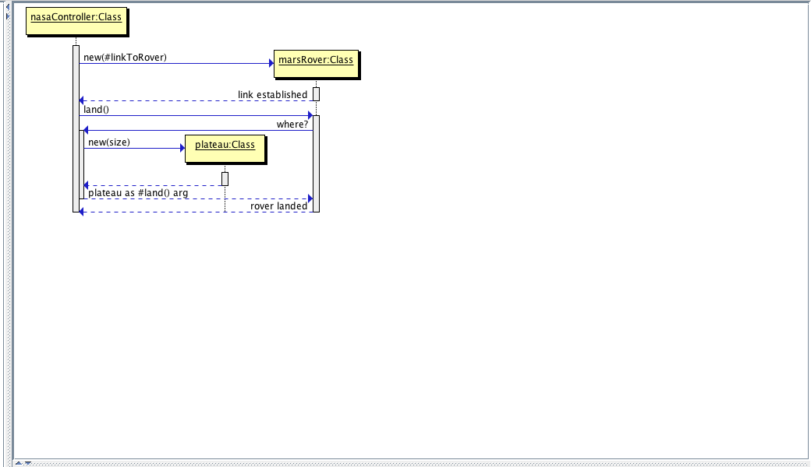

# :satellite: MARS ROVER :satellite:

##Thoughtworks Tech Assignment

As part of the ThoughtWorks application process, I have been asked to complete the 'Mars Rover' kata. In building the Mars Rover app, I intend to demonstrate my current development ability. In particular I'd like to showcase my knowledge of areas such as Test Driven Development (TDD), Object-Oriented Programming (OOP), design principals of OOP such as the Single Responsibility Principle (SRP), encapsulation and dependency management, and design patterns, which can be used to improve adherence with these principals.

##The Problem

A squad of robotic rovers are to be landed by NASA on a plateau on Mars. This plateau, which is curiously rectangular, must be navigated by the rovers so that their on-board cameras can get a complete view of the surrounding terrain to send back to Earth.

A rover’s position and location is represented by a combination of x and y co-ordinates and a letter representing one of the four cardinal compass points. The plateau is divided up into a grid to simplify navigation. An example position might be 0, 0, N, which means the rover is in the bottom left corner and facing North.

In order to control a rover, NASA sends a simple string of letters. The possible letters are ‘L’, ‘R’ and ‘M’. ‘L’ and ‘R’ makes the rover spin 90 degrees left or right respectively, without moving from its current spot. ‘M’ means move forward one grid point, and maintain the same heading.

Assume that the square directly North from (x, y) is (x, y+1).

####Input:

- The first line of input is the upper-right coordinates of the plateau, the lower-left coordinates are assumed to be 0,0.
- The rest of the input is information pertaining to the rovers that have been deployed. Each rover has two lines of input. The first line gives the rover’s position, and the second line is a series of instructions telling the rover how to explore the plateau.
- The position is made up of two integers and a letter separated by spaces, corresponding to the x and y co-ordinates and the rover’s orientation.
- Each rover will be finished sequentially, which means that the second rover won’t start to move until the first one has finished moving.

####Output:

 The output for each rover should be its final co-ordinates and heading.

####Input and Output

**Test Input:**

5 5  
1 2 N  
LMLMLMLMM  
3 3 E  
MMRMMRMRRM  

**Expected Output:**

1 3 N  
5 1 E  

In the administration of our assessments, ThoughtWorks strives to provide an equal testing opportunity for all candidates. Therefore, we will provide reasonable adjustment to our standard test taking procedures for applicants who have a documented disability within the meaning of the Equality Act. Please let us know when we contact you to schedule the assessments if you require any reasonable adjustment to the standard test taking procedures.

Copyright 2012 ThoughtWorks, Inc

##Installation

Unzip 'mars-rover.zip' and using the terminal, access the directory that has been created.

`$ cd mars-rover`

This Mars Rover application makes use of the Bundler gem. This gem provides a consistent environment for ruby projects, further information and documentation can be found [here](http://bundler.io/). If you haven't already done so, run the following command to install the Bundler gem.

`$ gem install bundler`

Make use of the Bundler gem and set up a local environment equivalent to the one used to build the app.

`$ bundle install`

You can now run the following commands:

  `$ rspec`

  provides a printout of the testing suite, the final line provides a percentage of the program covered by the tests.

  `$ rubocop`

  to see any differences between the projects code and the [Ruby Style Guide](https://github.com/bbatsov/ruby-style-guide)

##The Design

The primary purpose of the project has been to demonstrate development skills. With this in mind, the Ruby programming language has been chosen for the project since it's the language I am most comfortable with.

###Assumptions

###Approach

####User Stories
On receiving the problem, it became clear that a process was required to break the task down into manageable parts. Considering that the problem appears to be designed to mimic a client's requirements, one method for doing this is User Stories. A User Story describes what a program is required to do, from the perspective of someone using that program. A User Story, therefore, gives strong indication of the messages and objects required from the program. These messages and objects are fundamental to OOP.

Analysis of each sentence of the assignment has meant that, by using the Stakeholder/Motivation/Action format, it has been possible to construct User Stories. From these User Stories, it has then been possible to construct a table of Messages and Domain Objects. Consider the following example:

**The sentence**

*A squad of robotic rovers are to be landed by NASA on a plateau on Mars.*

**The Stakeholder:**

*NASA*

**The Motivation:**

*To have a robotic rover on a Mars plateau*

**The Action:**

*Land a robotic rover on a plateau on Mars*

**The constructed User Story:**

*As a NASA controller,
So that I can have a robotic rover on a Mars plateau,
I would like to be able to land a Mars Rover on a plateau.*

**The table of Messages and Domain Objects**

|Messages       |Domain Objects |
|---------------|---------------|
|               |NASA Controller|
|Land a rover   |Mars Rover     |
|               |Plateau        |

Above each User Story is the sentence that has formed the basis for its development.

**User Story One:**
*A squad of robotic rovers are to be landed by NASA on a plateau on Mars.*
```
As a NASA controller,
So that I can have a robotic rover on a Mars plateau,
I'd like to be able to land a Mars Rover on the plateau.
```

####Sequence Diagram
In order to form an intention about the messages and objects that are going to satisfy each User Story, a flexible way to experiment with these messages and objects needs to be devised. Sequence Diagrams are a perfect, low-cost way to do this. They provide a means of trying out different arrangements, provide clarity to design and allow collaboration and communication with other designers.

For this assignment, the Sequence Diagram shall be written in the Unified Modeling Language (UML), and rendered in the application 'Sequence Diagram Editor'. This application can be downloaded [here](#), but understanding security needs, static screenshots have also been included in this readme.

Keeping with the example above, User Story One has produced the following steps to create the final sequence diagram:

**Step One**

Using the messages taken from the 'Messages and Domain Objects' table, define the most basic functionality.



**Step Two**

Consider the domain objects and their creation.



**Step Three**

Refactor to consider how the Messages can form the basis of the application as opposed to the Domain Objects. Notice how the #land method is now the trigger for the creation of the plateau object.



####Test Driven Development
Test Driven Development (TDD) starts with a test. The first test is an automation test, which to begin with fails. The next step is to write a failing unit test followed by the simplest code required to pass that unit test. Continuing down this path leads to writing more failing unit tests and passing them with the simplest code possible until the original automation test passes. This was the path followed when developing the Mars Rover application.
